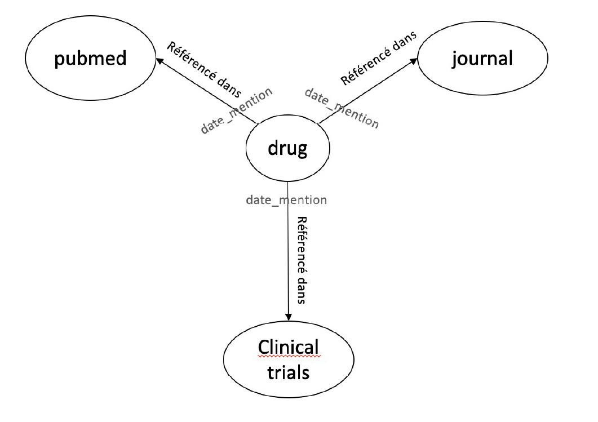
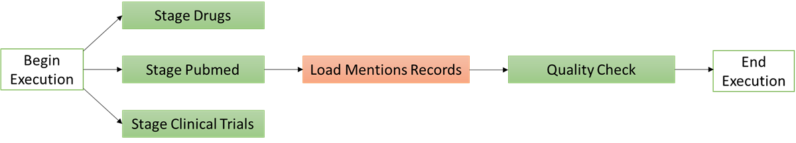
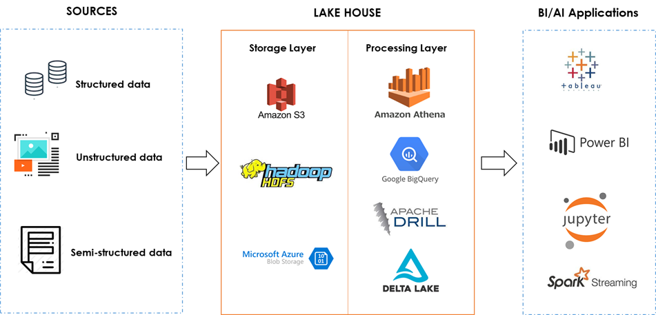

## Data Engineering Project

#### Project Summary

The object of this project is to create a data pipeline in Python to extract informations from the following sources,
transform them and load them to our final data model:

- **drugs.csv** contains drugs informations:
 * `atccode` = drug id
 * `drug` = drug name

- **pubmed.csv** comes from PubMed, which is a free search engine accessing primarily the MEDLINE database of references and abstracts on life sciences and biomedical topics. It contains:
 * `id` = publication id
 * `title` = publication title
 * `date` = publication date
 * `journal` = journal name
 
- **clinical_trials.csv** come from the largest clinical trials database ClinicalTrials.gov:
 * `id` = publication id
 * `scientific_title` = publication title
 * `date` = publication date
 * `journal` = journal name

We'll use **PySpark** considering the scalability in the future.
 
And the project follows the follow steps:
* Step 1: Explore and Clean the Data
* Step 2: Define the Data Model
* Step 3: Run ETL to Model the Data
* Step 4: Traitement ad-hoc
* Step 5: To go further

### Step 1: Explore and Clean the Data
#### Explore the Data 
Data quality issues:
###### drug
- Better to use lowercase of the drugs names

###### pubmed
- Change title text to lowercase for matching drug names
- Date value need to be in a uniform format

###### clinical trials
- Missing value
- Duplicated records
- Date value need to be in a uniform format

#### Cleaning Steps

###### drug
- Change drug name to lowercase

###### pubmed
- Change title value to lowercase
- Change date value to date format yyyy-mm-dd

###### clinical trials
- Change title value to lowercase
- Change date value to date format yyyy-mm-dd
- Fill missing value for column of id and journal, then remove duplicated values 

### Step 2: Define the Data Model

#### 3.1 Conceptual Data Model
Our final schema will represent relations between the drug and the published articles in which the drug name has been mentioned.
And we will name the final model **mention_records**, it contains following attributes:
 * `atccode` = drug id
 * `drug` = drug name
 * `id` = article id
 * `title` = article title
 * `date` = publishing date
 * `journal` = journal name
 
 ### Step 3: Run ETL to Model the Data
 - The datapipline is dynamic and built from reusable tasks as below: 
    - stage_drug
    - stage_pubmed
    - stage_clinical_trials
    - load_mention_records
    - check_count
 - And they can be easily intergrated into DAG:
  
    
 - Run the etl.py, and you will get **mention_records.json** in the datalake folder.
 ```
 python etl.py
 ```
 

 - 
 
 ### Step 4: Traitement ad-hoc
 - Question: Which journal has mentioned the most different drugs?
 - The answer is "Psychopharmacology"
 * `publication` = publishing plateform 'pubmed' or 'clinical trials'
 
### Step 5: To go further
* What are the elements to consider in order to develop your code so that it can handle large volumes of data (files of several TB or millions of files for example)?
    - Use Spark cluster to parallelise calculations across multiple computers.
    - Use distributed storage system to enable a quick access to data over a large number of nodes. e.g. Hadoop HDFS, AWS S3, etc.
    - Use Lake House achitecture instead of using traditional Data Warehouse or Data Lake.
    

